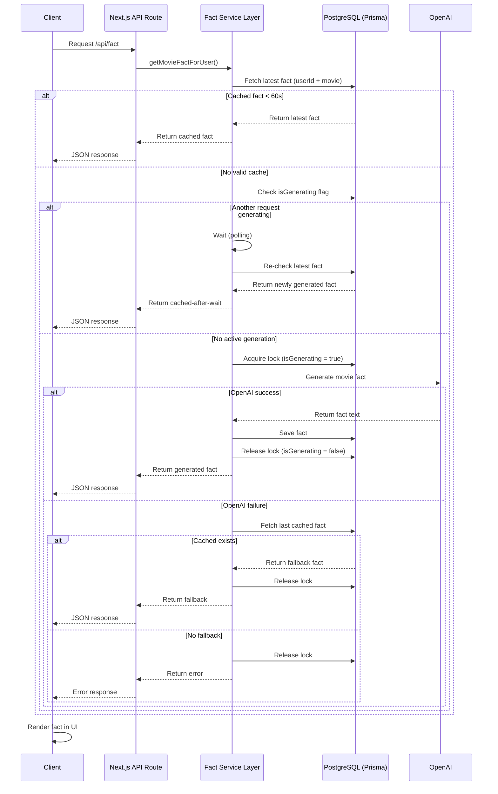

# 🎬 Movie Memory — Full-Stack AI Application

A full-stack web application that allows users to authenticate via Google, store their favorite movie, and generate AI-powered fun facts with backend caching and concurrency control.

---

# 🚀 Features

### 🔐 Authentication
- Google OAuth login (NextAuth/Auth.js)
- Secure session handling
- Protected routes

---

### 🧾 Onboarding
- First-time users provide their favorite movie
- Server-side validation:
  - trimmed input
  - min/max length enforced
- Stored in PostgreSQL via Prisma

---

### 📊 Dashboard
Displays:
- User name
- Email
- Profile photo (fallback if unavailable)
- Favorite movie
- Logout button

---

### 🤖 AI Fact Generation
- Generates fun facts using OpenAI API
- Stores facts in database
- Supports repeated generation

---

# ⚡ Variant Chosen

## ✅ Variant A — Backend-Focused (Caching & Correctness)

I chose Variant A to demonstrate backend correctness, caching strategies, and concurrency handling. This aligns with my interest in backend systems and scalable architectures.

---

# ⚙️ Variant A Implementation

## ⏱️ 1. 60-Second Cache Window

- Retrieves latest fact for `(userId + movie)`
- If within 60 seconds → returns cached result
- Else → generates new fact and stores it

✅ Reduces API calls  
✅ Improves performance  

---

## 🔒 2. Concurrency / Burst Protection

Implemented using a **database-backed lock (`isGenerating`)**

### Approach:
- Acquire lock via atomic DB update (`updateMany`)
- If another request is generating:
  - wait briefly (polling)
  - reuse cached result if available

### Prevents:
- duplicate OpenAI calls
- race conditions from rapid refresh / multi-tabs

---

## 🛟 3. Failure Handling

If OpenAI fails:
- return most recent cached fact (if exists)
- otherwise return user-friendly error

---

## 🧪 4. Backend Tests

Implemented using Jest:

- ✅ Cache logic test (ensures reuse within 60 seconds)
- ✅ Authorization test (ensures user isolation)

---

## 🧠 Architecture & Fact Generation Flow

This diagram reflects the Variant A implementation, including caching, concurrency control, and failure handling mechanisms.
